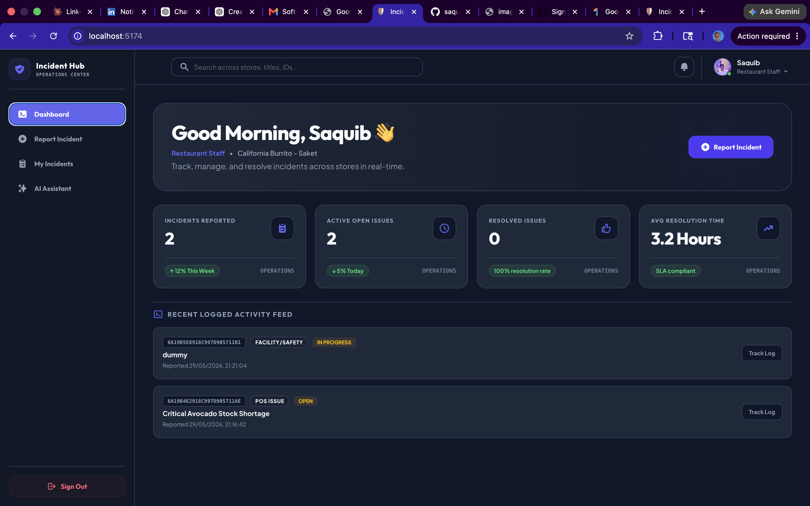
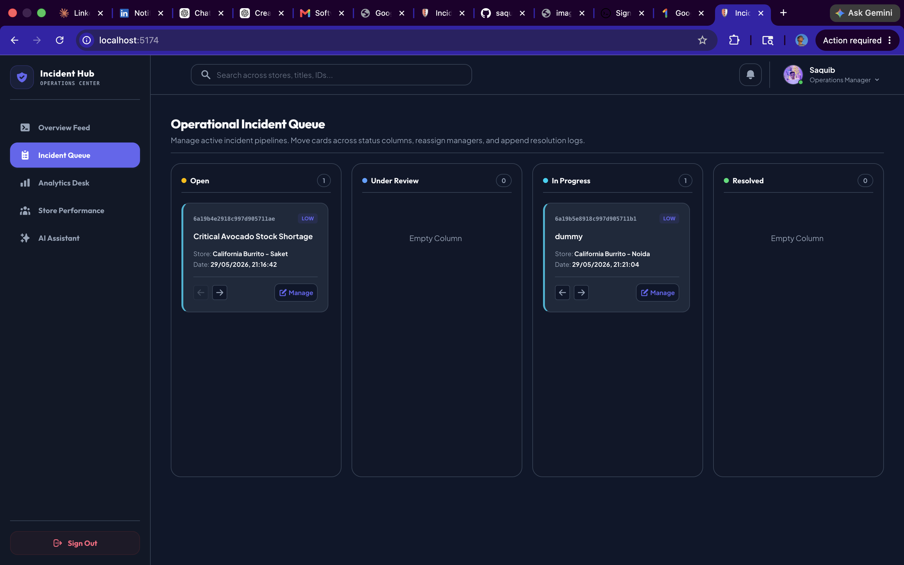
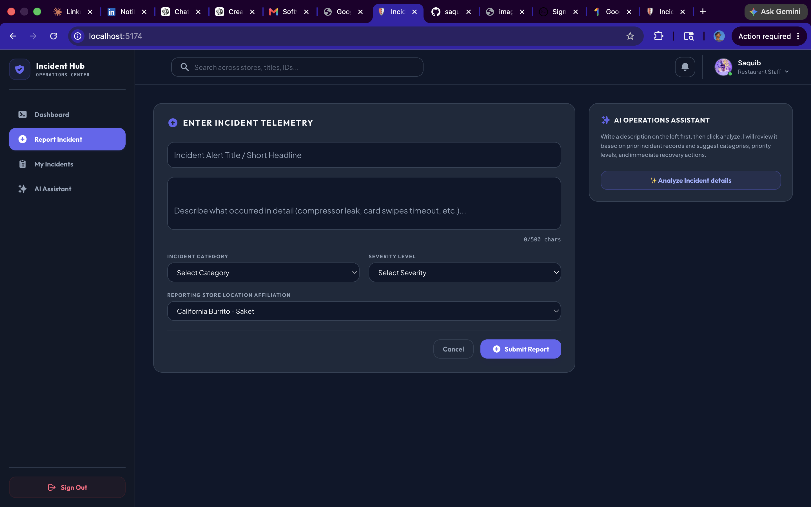
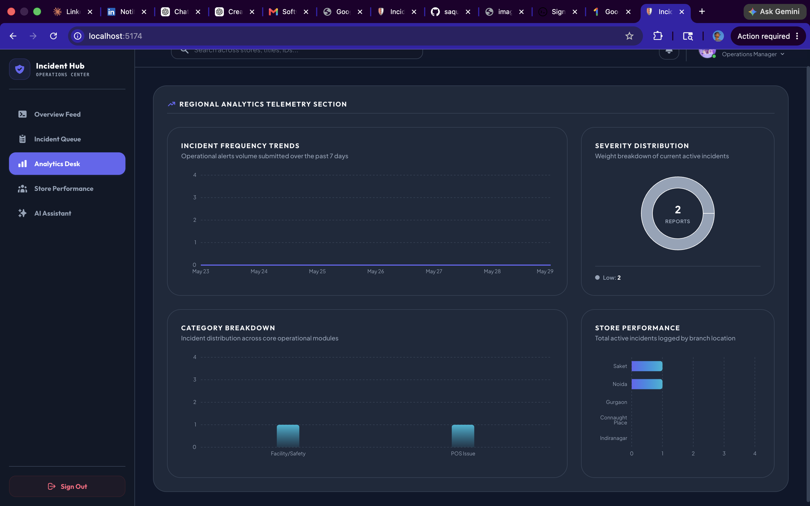

# Restaurant Incident Management System

<p align="center">
  
</p>

<p align="center">
  
</p>

<p align="center">
  <strong>AI-powered incident reporting + manager workflow for restaurant operations.</strong><br/>
  Built for production-readiness: clean architecture, scalable APIs, and deployment-first design.
</p>

<p align="center">
  
  
  
  
  
  
  
  
  
  
</p>

<p align="center">
  <a href="#-live-demo">Live Demo</a> •
  <a href="#-project-overview">Overview</a> •
  <a href="#-feature-showcase">Features</a> •
  <a href="#-screenshots">Screenshots</a> •
  <a href="#-architecture">Architecture</a> •
  <a href="#-api-documentation">API</a> •
  <a href="#-installation-guide">Install</a>
</p>

---

## 🚀 Live Demo

- Frontend URL: _Add Frontend Deployment Link_
- Backend URL: _Add Backend Deployment Link_
- GitHub Repository: _Add Repo Link_

---

## 📌 Project Overview

### Problem statement
Restaurant teams experience operational incidents daily (POS downtime, inventory gaps, equipment failures). When incidents are tracked across chats, calls, or spreadsheets, resolution becomes inconsistent, slow, and difficult to audit.

### Business impact
- **Revenue protection:** POS outages during peak hours reduce throughput immediately.
- **Safety & compliance:** equipment temperature incidents require traceability and timely action.
- **Operational efficiency:** managers need a clear queue and ownership, not a fragmented inbox.
- **Trend visibility:** recurring incidents should become measurable insights, not anecdotal complaints.

### Why restaurant incident management matters
Incidents don’t just “happen”—they compound. Without a standardized workflow and analytics, teams repeat the same mistakes and managers can’t prioritize what hurts the business most.

### How this platform solves it
- A structured incident record with status workflow (Open → Under Review → In Progress → Resolved)
- Role-based views for staff vs manager
- AI analysis to standardize categorization and urgency
- Aggregations to generate operational insights from real incident data

### Real-world examples
- **POS failures:** “Card payments failing during lunch rush” → high severity, immediate escalation
- **Inventory shortages:** “Avocado stockout across two stores” → medium/high severity, transfer stock
- **Kitchen equipment:** “Freezer above safe temperature” → critical severity, food safety action plan
- **Delivery delays:** “Supplier delivery delayed by 3 hours” → adjust prep, communicate ETA
- **Customer complaints:** “Multiple orders returned due to cold food” → investigate line, retrain

---

## ✨ Feature Showcase

### Staff features
- Report incidents with consistent fields and validation
- View their own submitted incidents (no data leakage)
- Track workflow status changes and resolution notes
- Use the AI assistant to draft category, severity, and recommended action

### Manager features
- View and manage all incidents across stores
- Update workflow status, assign manager, and add resolution notes
- Access analytics and insights to identify operational trends

### AI features (Groq)
- Incident categorization (POS Issue, Kitchen Equipment, Inventory, etc.)
- Severity prediction (Low → Critical)
- Concise summary generation
- Recommended action for immediate response

### Analytics features
- Dashboard stats: total/open/resolved/critical
- Aggregated operational insights (top category, average severity, week-over-week signals)

---

## 🖼️ Screenshots

## Login Screen

*Role selection and session start. Recruiters: look for clean role-based UX entry point.*

---

## Staff Dashboard

*Staff landing view with activity feed and quick access to reporting.*

---

## Manager Dashboard

*Manager workflow view (queue/kanban). Recruiters: look for operational prioritization.*

---

## Incident Reporting Form

*Validated incident entry with consistent schema mapping to MongoDB.*

---

## AI Assistant

*LLM-backed incident analyzer using Groq. Recruiters: look for JSON-only structured outputs.*

---

## Analytics Dashboard

*Aggregations and charts from stored incidents. Recruiters: look for measurable insights.*

---

## Profile Drawer

*Role context, user info, and settings.*

---

## 🏗️ Architecture

```text
Frontend (React + Vite)
        ↓
REST API (Node.js + Express)
        ↓
MongoDB Atlas (Mongoose)
        ↓
Groq AI (Incident Analyzer)
```

### Layer responsibilities
- **Frontend:** role-based dashboards, incident creation UI, charts, responsive UX
- **API:** validation, role enforcement (mock auth), filtering/search, analytics endpoints
- **Database:** canonical incident record with status workflow and timestamps
- **AI:** consistent categorization + severity + recommended action (JSON-only contract)

---

## 🧰 Tech Stack

### Frontend
- React, Vite, Tailwind CSS
- Framer Motion (animations), Recharts (analytics)

### Backend
- Node.js, Express.js
- MongoDB Atlas, Mongoose
- Groq AI SDK

### Deployment
- Vercel (frontend)
- Render (backend)

### Development tools
- ESLint
- dotenv for environment config

---

## 🔄 Role Workflow

```text
Restaurant Staff
   ↓
Create Incident
   ↓
Manager Review
   ↓
Status Updates
   ↓
Resolution Notes
   ↓
Resolved
```

---

## 🤖 AI Assistant (Groq)

### What it does
Given an incident description, the AI returns a strict JSON object:

```json
{
  "category": "POS Issue",
  "severity": "High",
  "summary": "POS terminal outage affecting customer transactions during peak hours.",
  "recommendedAction": "Escalate immediately to technical support and activate backup ordering procedures."
}
```

### Request example

`POST /api/ai/analyze`

```json
{ "description": "POS machine stopped working during lunch rush." }
```

### Notes recruiters should observe
- JSON-only output contract (safer for production parsing)
- Category + severity restricted to allowed enums
- AI integration isolated behind a service layer (`src/services/groqService.js`)

---

## 📂 Project Structure

```text
.
├─ frontend/                 # React UI (Vite)
├─ server/                   # Express API + MongoDB + Groq
├─ client/README.md          # Frontend documentation entry (alias)
├─ screenshots/              # Product showcase screenshots
└─ docs/screenshots/         # Raw screenshots (source)
```

> Note: The UI folder is named `frontend/` in this repository. The required `client/README.md` is provided as a dedicated frontend README entrypoint.

---

## ⚙️ Installation Guide

### 1) Backend setup

```bash
cd server
npm install
cp .env.example .env
npm run dev
```

`server/.env`:
- `PORT=5055` (example)
- `MONGODB_URI=...`
- `GROQ_API_KEY=...` (required for AI endpoints)

### 2) Frontend setup

```bash
cd frontend
npm install
cp .env.example .env
npm run dev
```

`frontend/.env`:
- `VITE_API_BASE_URL=http://localhost:5055`

---

## 📡 API Documentation

### Response format

Success:
```json
{ "success": true, "data": {} }
```

Error:
```json
{ "success": false, "message": "Error message" }
```

### Incident APIs (`/api/incidents`)

- `POST /api/incidents`
- `GET /api/incidents` (supports `category`, `severity`, `status`, `storeName`, `search`)
- `GET /api/incidents/:id`
- `PUT /api/incidents/:id`
- `DELETE /api/incidents/:id`
- `PATCH /api/incidents/:id/status` (manager-only)
- `GET /api/incidents/stats` (manager-only)

Example filter:
```text
GET /api/incidents?severity=Critical&status=Open
```

Example search:
```text
GET /api/incidents?search=POS
```

### AI APIs (`/api/ai`)

- `POST /api/ai/analyze`
- `GET /api/ai/insights` (manager-only)

### Status codes (high level)

- `200` OK
- `201` Created
- `400` Validation error
- `403` Forbidden (role)
- `404` Not found
- `500` Server error

---

## 🧠 Design Decisions

- **React + Vite:** fast dev loop, modern tooling, easy deployment to Vercel
- **MongoDB Atlas:** flexible schema for evolving incident metadata + strong aggregation support
- **Groq AI:** low-latency inference for incident triage and operational recommendations
- **Role-based UX:** staff and managers have different priorities; separate flows reduce complexity
- **Mock auth (no JWT):** assessment-friendly focus on workflow + API correctness; easy to extend later
- **Dark mode UI:** operations dashboards benefit from high-contrast, low-fatigue design

---

## 🗺️ Future Roadmap

- JWT authentication + RBAC
- Image/file uploads (evidence attachments)
- Notifications + email alerts
- Real-time updates via Socket.io
- Multi-store permissions and manager assignments
- Audit logs for compliance
- Advanced analytics + forecasting

---

## 👤 Author

**Saquib Sarfaraz**  
B.Tech Computer Science Engineering — Jamia Hamdard

- GitHub: _Add your GitHub URL_
- LinkedIn: _Add your LinkedIn URL_
- Portfolio: _Add your portfolio URL_

---

## 📚 Additional READMEs

- Frontend: `client/README.md`
- Backend: `server/README.md`
